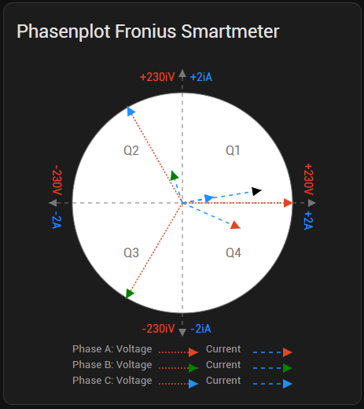

# Fronius Smartmeter IP Integration für Home Assistant

[![GitHub Release][releases-shield]][releases-link]
[![License][license-shield]][license-link]

Diese benutzerdefinierte Integration für Home Assistant ermöglicht das Auslesen von Daten eines Fronius Smartmeters IP dessen API über eine htaccess-Authentifizierung geschützt ist. Sie stellt diverse elektrische Messwerte als Sensoren bereit und beinhaltet eine passende Lovelace-Karte zur Visualisierung des Phasenplots. Ein passender Wechselrichter (z.B. GEN24) ist nicht erforderlich!

## Screenshots


## Features

* Auslesen von Echtzeitdaten des Fronius Smart Meters über die lokale API.
* Unterstützung für htaccess-geschützte API-Endpunkte (`/wizard/public/api/measurements` und `/wizard/public/api/measurements/configuration`).
* **Sensoren für eine Vielzahl von Messwerten:**
    * Spannung (L1, L2, L3, L1-L2, L2-L3, L3-L1, Durchschnitt)
    * Strom (L1, L2, L3, N)
    * Wirkleistung (L1, L2, L3, Gesamt, Fundamental, Harmonisch)
    * Blindleistung (L1, L2, L3, Gesamt)
    * Scheinleistung (L1, L2, L3, Gesamt)
    * Leistungsfaktor (L1, L2, L3, Gesamt)
    * Frequenz
    * Temperatur des Geräts (falls von API bereitgestellt)
    * Betriebszeit
    * THD (Total Harmonic Distortion) für Spannung und Strom
    * Phasenwinkel (Spannungswinkel absolut, Stromwinkel als V-I Differenz)
    * Umfangreiche Energiezähler (Wirk-, Blind-, Scheinenergie für Bezug/Export, aufgeteilt nach Phasen, Fundamental/Harmonisch)
* **Status-Binärsensoren:** Zeigen den Status verschiedener Messungen an (z.B. "Phase A Daten OK").
* **Konfiguration über die Home Assistant UI:** Einfache Einrichtung von URL, Benutzername und Passwort.
* **Zugehörige Lovelace Custom Card:** Visualisiert die Spannungs- und Stromvektoren in einem Phasenplot (SVG-basiert), ähnlich der Weboberfläche des Geräts.

## Voraussetzungen

* Eine laufende Home Assistant Instanz.
* Ein Fronius Smartmeter IP, der im lokalen Netzwerk erreichbar ist.

## Installation

Es gibt zwei Möglichkeiten, diese benutzerdefinierte Integration zu installieren:

### Option 1: Über HACS (Home Assistant Community Store) - Empfohlen (sobald verfügbar)

1.  **Voraussetzung:** HACS muss in deiner Home Assistant Instanz installiert sein.
2.  **Als benutzerdefiniertes Repository hinzufügen (solange die Integration nicht im HACS Default Store ist):**
    * Gehe in HACS zu "Integrationen".
    * Klicke auf die drei Punkte oben rechts und wähle "Benutzerdefinierte Repositories".
    * Füge die URL dieses GitHub-Repositorys (`https://github.com/OoZAGoO/fronius-smartmeter-ip-hacs`) ein.
    * Wähle als Kategorie "Integration".
    * Klicke auf "Hinzufügen".
3.  **Installation:**
    * Suche nach "Fronius Smartmeter IP" in der HACS-Integrationsliste.
    * Klicke auf "Installieren" und folge den Anweisungen.
4.  **Neustart:** Starte Home Assistant neu, wenn HACS oder die Integration dich dazu auffordert.

### Option 2: Manuelle Installation

1.  Lade das [neueste Release]([releases-link]) von GitHub herunter.
2.  Entpacke die heruntergeladene Datei (falls es ein ZIP ist).
3.  Kopiere den Ordner `fronius_smartmeter_ip` (den du im `custom_components`-Verzeichnis des Releases findest) in dein Home Assistant Konfigurationsverzeichnis unter dem Pfad `<config_dir>/custom_components/`. Wenn der `custom_components`-Ordner nicht existiert, erstelle ihn.
    Deine Verzeichnisstruktur sollte dann so aussehen:
    ```
    <config_dir>/
    └── custom_components/
        └── fronius_smartmeter_ip/
            ├── __init__.py
            ├── sensor.py
            ├── binary_sensor.py
            └── ... (alle anderen Dateien der Integration)
    ```
4.  **Neustart:** Starte Home Assistant neu.

## Konfiguration der Integration

Nach der Installation (manuell oder über HACS) und dem Neustart von Home Assistant:

1.  Gehe zu **Einstellungen > Geräte & Dienste**.
2.  Klicke unten rechts auf **"+ Integration hinzufügen"**.
3.  Suche nach "**Fronius Smartmeter IP**" und wähle es aus.
4.  Folge dem Dialog und gib die erforderlichen Informationen ein:
    * **URL:** Die Basis-IP deines Fronius Geräts (z.B. `192.168.1.100`). Gib hier nicht den vollen API-Pfad an, nur die Basisadresse.
    * **Benutzername:** Der Benutzername für die htaccess-Authentifizierung.
    * **Passwort:** Das Passwort für die htaccess-Authentifizierung.
5.  Klicke auf "Senden". Wenn die Verbindung erfolgreich ist, wird die Integration eingerichtet und die Entitäten werden erstellt.

## Bereitgestellte Entitäten

Die Integration erstellt eine Vielzahl von Sensoren. Die genauen Entitäts-IDs hängen von deiner Home Assistant Konfiguration und dem Namen ab, den du beim Einrichten der Integration ggf. vergibst (oft wird ein Teil der URL oder eine eindeutige ID verwendet). Der Standard-Präfix für die Sensornamen ist "Fronius SM". Beispiele für Entitäts-IDs könnten sein:

* `sensor.fronius_sm_deine_geraete_id_voltage_l1`
* `sensor.fronius_sm_deine_geraete_id_active_power_total`
* `sensor.fronius_sm_deine_geraete_id_forward_active_energy_total`
* `binary_sensor.fronius_sm_deine_geraete_id_phase_a_data_ok`

Eine vollständige Liste der Sensoren findest du nach erfolgreicher Einrichtung in den Entwicklerwerkzeugen von Home Assistant oder indem du nach Entitäten suchst, die mit `sensor.fronius_sm_...` bzw. `binary_sensor.fronius_sm_...` beginnen.

## Einrichtung der Lovelace Phasenplot-Karte (Manuell)

Diese Integration beinhaltet eine benutzerdefinierte Lovelace-Karte, um den Phasenplot (Spannungs- und Stromvektoren) darzustellen.

**Schritt 1: Kopieren der Kartendatei**

1.  Lade die Datei `fronius-smartmeter-ip-card.js` aus dem `dist/`-Verzeichnis dieses GitHub-Repositorys herunter.
2.  Erstelle das Verzeichnis `www` in deinem Home Assistant Konfigurationsverzeichnis (`<config_dir>/www/`), falls es noch nicht existiert.
    * Optional, aber empfohlen für Ordnung: Erstelle einen Unterordner speziell für Community-Karten, z.B. `<config_dir>/www/community/fronius-smartmeter-ip/`.
3.  Kopiere die heruntergeladene `fronius-smartmeter-ip-card.js` in dieses Verzeichnis.
    * Beispielpfad: `<config_dir>/www/community/fronius-smartmeter-ip/fronius-smartmeter-ip-card.js`

**Schritt 2: Als Lovelace-Ressource hinzufügen**

1.  Gehe in Home Assistant zu **Einstellungen > Dashboards**.
2.  Klicke oben rechts auf das Menü mit den **drei Punkten** und wähle "**Ressourcen**".
3.  Klicke unten rechts auf "**+ Ressource hinzufügen**".
4.  Gib die **URL** zur JavaScript-Datei ein. Diese beginnt mit `/local/` (was auf dein `/config/www/`-Verzeichnis verweist):
    * Wenn du die Datei nach `<config_dir>/www/community/fronius-smartmeter-ip/fronius-smartmeter-ip-card.js` kopiert hast, lautet die URL:
        `/local/community/fronius-smartmeter-ip/fronius-smartmeter-ip-card.js`
    * Wenn du sie direkt nach `<config_dir>/www/fronius-smartmeter-ip-card.js` kopiert hast:
        `/local/fronius-smartmeter-ip-card.js`
5.  Wähle als **Ressourcentyp** "**JavaScript-Modul**".
6.  Klicke auf "**Erstellen**".
7.  Möglicherweise musst du deinen Browser-Cache leeren (Strg+F5 oder Cmd+Shift+R), damit die Ressource korrekt geladen wird.

**Schritt 3: Karte zum Dashboard hinzufügen**

1.  Öffne das Dashboard, zu dem du die Karte hinzufügen möchtest, und aktiviere den Bearbeitungsmodus (Stiftsymbol).
2.  Klicke auf "**+ Karte hinzufügen**".
3.  Wähle unten die Karte "**Manuell**".
4.  Gib die folgende YAML-Konfiguration ein (passe die Entitäts-IDs an deine tatsächlichen Entitäten an!):

```yaml
type: custom:fronius-smartmeter-ip-card
title: Fronius Phasenplot # Optionaler Titel für die Karte
entities:
  # Ersetze die folgenden Entitäts-IDs mit deinen tatsächlichen Entitäts-IDs
  # Du findest sie in den Entwicklerwerkzeugen von Home Assistant.
  # Sie beginnen wahrscheinlich mit sensor.fronius_sm_...
  voltage_l1: sensor.DEIN_PREFIX_voltage_l1
  voltage_l2: sensor.DEIN_PREFIX_voltage_l2
  voltage_l3: sensor.DEIN_PREFIX_voltage_l3
  voltage_angle_l1: sensor.DEIN_PREFIX_voltage_phase_angle_l1
  voltage_angle_l2: sensor.DEIN_PREFIX_voltage_phase_angle_l2
  voltage_angle_l3: sensor.DEIN_PREFIX_voltage_phase_angle_l3
  current_l1: sensor.DEIN_PREFIX_current_l1
  current_l2: sensor.DEIN_PREFIX_current_l2
  current_l3: sensor.DEIN_PREFIX_current_l3
  current_angle_l1: sensor.DEIN_PREFIX_current_phase_angle_l1 # V-I Phasenwinkel L1
  current_angle_l2: sensor.DEIN_PREFIX_current_phase_angle_l2 # V-I Phasenwinkel L2
  current_angle_l3: sensor.DEIN_PREFIX_current_phase_angle_l3 # V-I Phasenwinkel L3
```
Ersetze DEIN_PREFIX mit dem tatsächlichen Präfix deiner Sensoren (z.B. fronius_sm_10_10_20_21 oder ähnlich, je nachdem wie die Entitäten von der Integration benannt wurden).

**Fehlerbehebung**
* Integration erscheint nicht nach Installation: Starte Home Assistant vollständig neu. Überprüfe die Home Assistant Protokolle (Logs) auf Fehlermeldungen bezüglich fronius_smartmeter_ip.
* Fehler bei der Konfiguration: Stelle sicher, dass URL, Benutzername und Passwort korrekt sind und die API des Fronius-Geräts erreichbar und für htaccess konfiguriert ist.
* Karte wird nicht angezeigt:
  * Überprüfe den Pfad zur JS-Datei in den Lovelace Ressourcen.
  * Leere den Browser-Cache oder versuche einen anderen Browser/Inkognito-Modus.
  * Öffne die Entwicklerkonsole des Browsers (F12) und suche nach JavaScript-Fehlern.
* Pfeile in der Karte fehlen / Karte zeigt keine Daten:
* Überprüfe, ob die in der Kartenkonfiguration angegebenen Entitäts-IDs korrekt sind und ob diese Sensoren in Home Assistant Werte liefern.
* Verwende die Entwicklerkonsole des Browsers, um console.log-Ausgaben deiner Karte zu überprüfen (falls du welche für Debugging hinzugefügt hast).

**Beitrag leisten**
Fehlerberichte sind herzlich willkommen! Bitte erstelle ein Issue für Fehler oder neue Ideen.

**Lizenz**
Dieses Projekt steht unter der MIT Lizenz. 

[releases-shield]: https://img.shields.io/github/v/release/OoZAGoO/fronius-smartmeter-ip-hacs?style=for-the-badge&label=Release
[releases-link]: https://github.com/OoZAGoO/fronius-smartmeter-ip-hacs/releases/latest

[license-shield]: https://img.shields.io/github/license/OoZAGoO/fronius-smartmeter-ip-hacs?style=for-the-badge
[license-link]: ./LICENSE